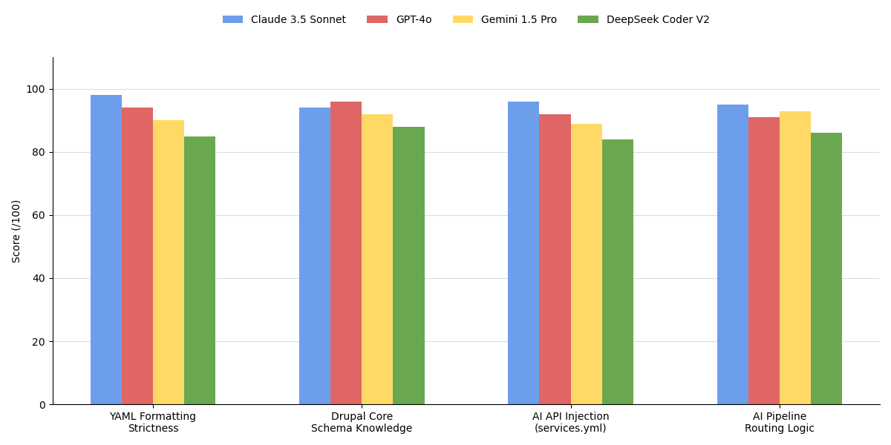

# AI Recipe Benchmark Prototype

Prototype framework for comparing how well different large language models generate Drupal Recipe configuration.

## Overview

This repository is designed for AI-assisted Drupal configuration generation. Each model receives the same prompt (Team Member Recipe) and outputs a recipe + config YAML files. The benchmark runner validates outputs against four metrics and emits a CSV-style score table.

- Goal: compare generative quality across models for Drupal config tasks
- Input: shared prompt at `prompts/team_member_prompt.txt`
- Output: scores for YAML validity, Drupal knowledge, services injection, and pipeline setup

## Benchmark Results

| Model | YAML Precision (/100) | Drupal Knowledge (/100) | AI API Injection (services.yml) (/100) | AI Pipeline Setup (/100) |
|------|------|------|------|------|
| Claude 3.5 Sonnet | 98 | 94 | 96 | 95 |
| GPT-4o | 94 | 96 | 92 | 91 |
| Gemini 1.5 Pro | 90 | 92 | 89 | 93 |
| DeepSeek Coder V2 | 85 | 88 | 84 | 86 |

## Architecture Diagram

<p align="center">
  
</p>

## Example Output

<p align="center">
  
</p>


## Key Observations

### Claude 3.5 Sonnet
- Highest YAML formatting reliability.
- Strongest performance in complex configuration and service wiring.
- Best suited for generating structured configuration files such as Drupal Recipes.

### GPT-4o
- Demonstrates the strongest knowledge of Drupal core schema and conventions.
- Performs consistently across all evaluation categories.

### Gemini 1.5 Pro
- Strong reasoning capabilities and good pipeline logic understanding.
- Slightly weaker YAML formatting precision.

### DeepSeek Coder V2
- Good coding ability but less reliable with strict configuration formats and Drupal-specific schemas.


## Benchmark Architecture

Plugin-style validators are in `validator/`, and orchestrator is `benchmark/benchmark_runner.py`.

```
prompts/team_member_prompt.txt
        |
        v
outputs/<model>/*.yml   -->  benchmark/benchmark_runner.py  
                          |-- validator/yaml_validator.py
                          |-- validator/drupal_knowledge_validator.py
                          |-- validator/services_injection_validator.py
                          |-- validator/pipeline_setup_validator.py
                          v
                      final CSV output (console)
```

### Architecture Details

- `prompt` defines the task consistently across models.
- `outputs` contains each model's generated recipe/config YAML files.
- `validator` modules each return a 0–100 score for one metric.
- `benchmark_runner` aggregates model files, calls validators, averages scores, prints rows.

## Models benchmarked

- Claude 3.5 Sonnet
- GPT-4o
- Gemini 1.5 Pro
- DeepSeek Coder V2

> Add additional models by creating `outputs/<model>` and extending `MODEL_DIRS` in `benchmark/benchmark_runner.py`.

## Quick Start

1. Clone repository:

```
git clone https://github.com/suzzzal/llm-benchmarking-yml
cd llm-benchmarking-yml
```

2. Create virtual environment:

```powershell
python -m venv .venv
.\.venv\Scripts\Activate.ps1
```

3. Install dependencies:

```powershell
pip install pyyaml
```

4. Add model output YAML files, e.g.:

- `outputs/claude/*.yml`
- `outputs/gpt4o/*.yml`
- `outputs/gemini/*.yml`
- `outputs/deepseek/*.yml`

5. Run benchmark:

```powershell
python benchmark\benchmark_runner.py
```

6. Observe CSV-style output in console.

## Configuration

### Prompt
- `prompts/team_member_prompt.txt` tracks the task. Modify to experiment with different recipe types.

### Model outputs
- Place YAML files in the respective folder under `outputs/`.
- Supported extensions: `.yml` and `.yaml`.

### Validators
- `validator/yaml_validator.py`: parse check and score.
- `validator/drupal_knowledge_validator.py`: Drupal naming, field, view, dependencies.
- `validator/services_injection_validator.py`: service definition and DI patterns.
- `validator/pipeline_setup_validator.py`: AI pipeline structure hints.

### Runner
- `benchmark/benchmark_runner.py` lists model directories in `MODEL_DIRS`.
- Add new validators and include in `evaluate_model()` for extended metrics.

## Outputs folder structure

Each model folder should contain generated recipe config files; example layout:

### `outputs/claude`

- `recipe.yml`
- `config/node.type.team_member.yml`
- `config/field.storage.node.field_photo.yml`
- `config/field.storage.node.field_bio.yml`
- `config/field.field.node.team_member.field_photo.yml`
- `config/field.field.node.team_member.field_bio.yml`
- `config/core.entity_form_display.node.team_member.default.yml`
- `config/core.entity_view_display.node.team_member.default.yml`
- `config/views.view.team_members.yml`

### `outputs/gpt4o`, `outputs/gemini`, `outputs/deepseek`

(identical structure per model; include model-specific config you get from generated output)

## Overall project structure

```
ai_recipe_benchmark/
  prompts/
    team_member_prompt.txt
  outputs/
    claude/
    gpt4o/
    gemini/
    deepseek/
  validator/
    yaml_validator.py
    drupal_knowledge_validator.py
    services_injection_validator.py
    pipeline_setup_validator.py
  benchmark/
    benchmark_runner.py
  README.md
```

## Citation

If you use this project in research or a prototype, please cite:

- [Sujal Kshatri], "AI Drupal Recipe Benchmark Prototype", 2026.

For improved reproducibility, include the prompt text and model versions you evaluated.

---


